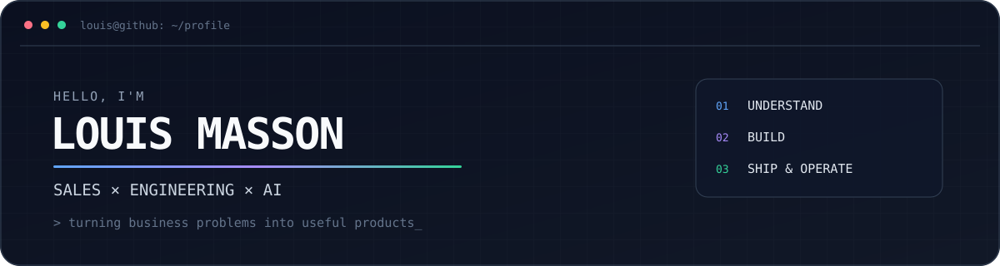

<div align="center">
  
</div>

<br />

I’m an Account Manager at **Devoteam Luxembourg** who also designs, ships, and operates software.

I work where commercial strategy meets product engineering: turning ambiguous business needs into practical products, validating value quickly, and improving what reaches production.

## Currently building

| Project | What it is | Explore |
| --- | --- | --- |
| **The Catalogue Studio** | A curated product discovery platform built around useful, intentional selections. | [thecatalogue.studio](https://thecatalogue.studio) |
| **ClaudeUsageBar** | A native macOS menu bar app for monitoring Claude subscription usage. | [Website](https://claudeusagebar.app) · [Repository](https://github.com/LouisMasson/ClaudeUsageBar) |
| **louismasson.me** | My personal corner of the web for projects, experiments, and writing. | [louismasson.me](https://louismasson.me) |
| **hotelradar.com** | Personal marketing employee for small hotel owner. | [hotelradar.com](https://hotel-radar-landing.vercel.app/) |

## How I work

```text
01  Understand the workflow and the real constraint
02  Prototype the smallest useful version
03  Ship, observe, and iterate
```

**Build:** AI-assisted development, automation, rapid prototyping  
**Operate:** Docker, Cloudflare, self-hosted infrastructure, observability  
**Connect:** SaaS sales, solution engineering, enterprise data

## Public repositories

- [**ClaudeUsageBar**](https://github.com/LouisMasson/ClaudeUsageBar) — native macOS usage monitor.
- [**gym-logger**](https://github.com/LouisMasson/gym-logger) — a focused workout logging project.
- [**LouisMasson**](https://github.com/LouisMasson/LouisMasson) — the source for this profile.

---

<div align="center">
  <a href="https://louismasson.me">Website</a> ·
  <a href="https://www.linkedin.com/in/louis-masson-businessdeveloper/">LinkedIn</a> ·
  <a href="https://lmasson04pro.substack.com/">Writing</a> ·
  <a href="https://x.com/Lmasson04pro">X</a> ·
  <a href="mailto:louis@louismasson.me">Email</a>
</div>
